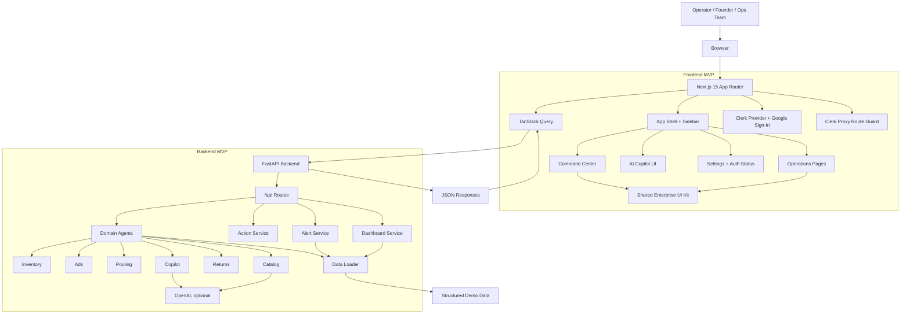
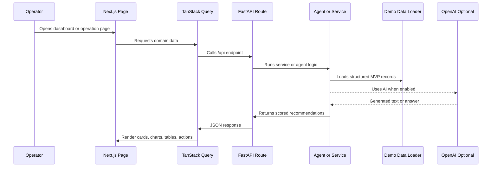
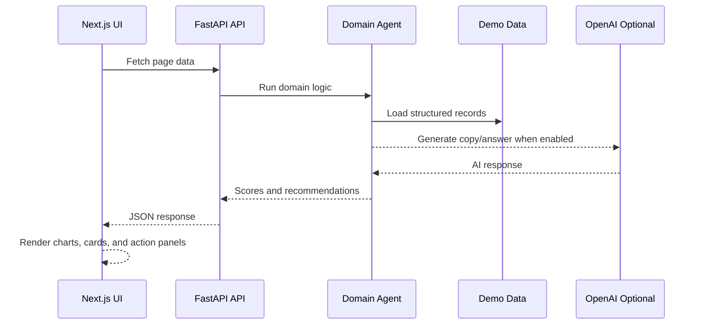

# ShelfSync AI Copilot

<p align="center">
  
</p>

ShelfSync AI Copilot is an AI-powered operations platform for quick-commerce brands selling across Blinkit, Zepto, and Instamart. It combines a Next.js command center with a FastAPI backend, AI agents, marketplace-style operational data, Clerk authentication, and workflow recommendations for inventory, ads, pooling, catalog, returns, finance, alerts, and executive decision-making.

The project is structured as a practical MVP that can be extended into a production SaaS product. The current codebase uses deterministic mock data and optional OpenAI-powered generation where useful, while keeping the same service boundaries that real marketplace integrations would use later.

## Table of Contents

- [Product Scope](#product-scope)
- [Core Features](#core-features)
- [Architecture](#architecture)
- [Repository Structure](#repository-structure)
- [Tech Stack](#tech-stack)
- [Local Setup](#local-setup)
- [Environment Variables](#environment-variables)
- [Deployment](#deployment)
- [Workflow Process](#workflow-process)
- [Quality Checks](#quality-checks)
- [Future Roadmap](#future-roadmap)

## Product Scope

ShelfSync AI Copilot helps quick-commerce operators answer high-impact questions:

- Which SKUs are likely to stock out soon?
- Which ad campaigns are wasting spend because inventory is low?
- Where can inventory be moved between platforms or dark stores?
- Which return records have payout or inventory reconciliation gaps?
- What product listing copy should be generated for each marketplace?
- Which finance metrics need attention this week?
- What should the operator do next?

The product is currently optimized for a demo/MVP workflow, but the system is organized around production-ready domains: frontend experiences, backend API routes, agent-style business logic, service orchestration, schemas, and reusable UI components.

## Core Features

### Command Center

- Enterprise-style executive dashboard.
- Live KPI cards for stores, alerts, AI tasks, revenue risk, stockout risk, ad waste, pooling moves, returns, and margin leakage.
- Charts for risk trends, demand forecasting, marketplace revenue, and order distribution.
- Ranked AI action briefs and recent alert panels.

### AI Copilot

- Conversational assistant for operational questions.
- Backend context builder combines inventory, ads, pooling, returns, and alerts.
- Deterministic fallback responses keep the app usable without an OpenAI key.

### Inventory Intelligence

- SKU-level stockout risk scoring.
- Dark-store inventory visibility.
- Hours-to-stockout and replenishment recommendations.
- Risk distribution by marketplace.

### Ad Intelligence

- Campaign spend and ROAS analysis.
- At-risk campaign identification.
- Spend versus inventory availability view.
- Recommendations to pause, reduce, or optimize campaigns.

### Pooling Optimizer

- Cross-platform inventory balancing.
- Transfer recommendations between source and destination locations.
- Unit movement recommendations and estimated revenue recovery.
- Platform balance overview.

### Catalog Intelligence

- AI-assisted marketplace listing generation.
- Platform-specific titles, descriptions, content score, and tone.
- Deterministic listing generation fallback.

### Returns Audit

- Return discrepancy detection.
- Payout gap visibility.
- Risk scoring and dispute candidate identification.
- Platform-level leakage chart.

### Finance Intelligence

- Revenue, profit, margin, leakage, and revenue-at-risk views.
- SKU profitability.
- Marketplace revenue contribution.

### Authentication

- Clerk-backed Google sign-in support.
- Public login and SSO callback routes.
- Optional route protection when Clerk keys are configured.

## Architecture

The MVP is built as a two-app system: a Next.js SaaS dashboard for operators and a FastAPI service that exposes recommendation APIs. The frontend is already redesigned around a shared enterprise operations UI layer, while the backend keeps the recommendation logic separated into domain agents and services so real marketplace integrations can be added later without changing the whole product shape.



### Frontend Layer

The frontend lives in `frontend/` and uses Next.js App Router. The MVP includes the Command Center, six redesigned Operations pages, the AI Copilot page, settings, auth screens, alerts, and connector surfaces.

Key responsibilities:

- `frontend/app/page.tsx` renders the Command Center with live KPI cards, enterprise top layer, charts, action briefs, and alert summaries.
- `frontend/app/inventory`, `ads`, `pooling`, `catalog`, `returns`, and `finance` render the redesigned operations workflows.
- `frontend/components/operations-ui.tsx` provides the shared enterprise UI system for heroes, KPI cards, panels, selects, badges, loading states, and error states.
- `frontend/components/app-shell.tsx` and `frontend/components/app-sidebar.tsx` provide the persistent SaaS navigation shell.
- `frontend/components/ai-copilot-float.tsx` keeps the copilot available across the app.
- `frontend/lib/api.ts` centralizes all frontend-to-backend API calls through `NEXT_PUBLIC_API_BASE_URL`.

### Backend Layer

The backend lives in `backend/` and uses FastAPI. API routes are registered in `backend/api/routes.py` and mounted under `/api`. The current MVP serves recommendation data, generated catalog content, copilot answers, alerts, and simulated workflow actions.

Key responsibilities:

- `backend/main.py` creates the FastAPI app and CORS configuration.
- `backend/api/routes.py` exposes dashboard, inventory, ads, catalog, returns, pooling, alerts, actions, and copilot endpoints.
- `backend/services/dashboard_service.py` assembles Command Center summary data.
- `backend/services/action_service.py` returns simulated action execution responses.
- `backend/services/alert_service.py` serves alert records.
- `backend/utils/data_loader.py` loads structured demo data used by agents and services.

### Agent and Service Layer

Domain agents contain the MVP business logic:

- `inventory_agent.py`: stockout risk scoring and replenishment suggestions.
- `ad_agent.py`: campaign and ROAS recommendations.
- `pooling_agent.py`: cross-platform transfer recommendations.
- `catalog_agent.py`: marketplace listing generation.
- `returns_agent.py`: return discrepancy audit logic.
- `copilot_agent.py`: conversational context and answers.

The current AI design is hybrid:

- Deterministic logic powers the demo reliably even without external services.
- OpenAI is optional for catalog generation and copilot responses.
- Future real-time marketplace APIs can replace the demo data loader while keeping the same route and agent boundaries.

### MVP Data Flow




## Tech Stack

### Frontend

- Next.js 15 App Router
- React 19
- TypeScript
- Tailwind CSS
- TanStack Query
- Recharts
- Lucide React
- Clerk for authentication

### Backend

- Python 3.11+
- FastAPI
- Uvicorn
- Pydantic
- python-dotenv
- OpenAI Python SDK
- HTTPX

## Local Setup

### Prerequisites

- Node.js 18+ or newer
- npm
- Python 3.11+
- OpenAI API key, optional but recommended for AI generation
- Clerk application keys, optional but recommended for auth testing

### 1. Clone the Repository

```bash
git clone <your-repository-url>
cd "ShelfSync AI Copilot"
```

### 2. Backend Setup

```bash
cd backend
python -m venv .venv
.venv\Scripts\Activate.ps1
pip install -r requirements.txt
copy .env.example .env
python main.py
```

Backend URL:

```text
http://127.0.0.1:8000
```

Health check:

```text
http://127.0.0.1:8000/
```

### 3. Frontend Setup

Open a second terminal:

```bash
cd frontend
npm install
copy .env.example .env.local
npm run dev
```

Frontend URL:

```text
http://localhost:3000
```

## Environment Variables

### Backend: `backend/.env`

```env
OPENAI_API_KEY=your-openai-api-key-here
CORS_ORIGINS=http://localhost:3000,http://127.0.0.1:3000
```

Notes:

- `OPENAI_API_KEY` enables OpenAI-assisted generation.
- The app includes deterministic fallbacks for some AI workflows when OpenAI is unavailable.
- `CORS_ORIGINS` should include the frontend origin during local development.

### Frontend: `frontend/.env.local`

```env
NEXT_PUBLIC_API_BASE_URL=http://127.0.0.1:8000
NEXT_PUBLIC_APP_URL=http://localhost:3000
NEXT_PUBLIC_CLERK_PUBLISHABLE_KEY=
CLERK_SECRET_KEY=
```

Notes:

- `NEXT_PUBLIC_API_BASE_URL` must point to the FastAPI backend.
- Clerk keys are optional for local demo access.
- When both Clerk keys are set, the proxy protects non-public routes.
- `/login` and `/sso-callback` remain public auth surfaces.

## Deployment

For production, deploy the frontend from `frontend/` on Vercel and the backend from `backend/` on Railway or Render. Set `NEXT_PUBLIC_API_BASE_URL` to the backend URL, set `NEXT_PUBLIC_APP_URL` to the Vercel URL, and include the Vercel origin in backend `CORS_ORIGINS`.

## Workflow Process

### Operator Workflow


### Data and Recommendation Workflow



### Development Workflow

1. Update backend agent/service logic when changing recommendation behavior.
2. Update schemas if request or response contracts change.
3. Update `frontend/lib/types.ts` and `frontend/lib/api.ts` when API shapes change.
4. Update the relevant page under `frontend/app/`.
5. Reuse shared components from `frontend/components/operations-ui.tsx` for operation pages.
6. Run type checks and manually verify the affected route.
7. Update this README when setup, routes, architecture, or workflows change.

## Quality Checks

### Frontend Type Check

```bash
cd frontend
npm run typecheck
```

### Frontend Build

```bash
cd frontend
npm run build
```

### Backend Smoke Test

```bash
cd backend
python main.py
```

Then open:

```text
http://127.0.0.1:8000/
http://127.0.0.1:8000/api/dashboard/summary
```

## Future Roadmap

### Near-Term

- Add richer loading and empty states for every page.
- Add unit tests for backend agents and services.
- Add frontend component tests for shared operation UI.
- Add API error boundaries and retry states.
- Improve Clerk route protection UX for signed-out users.
- Add sample screenshots to README once the GitHub repo is public.

### Product Expansion

- Real marketplace API connectors for Blinkit, Zepto, and Instamart.
- Real inventory writebacks and transfer-order workflows.
- Alert rules engine with severity thresholds.
- Slack, email, and WhatsApp notifications.
- Multi-tenant organization and role management.
- Audit log for every AI recommendation and executed action.
- Scheduled reports for leadership and operations teams.

### AI and Data Expansion

- Demand forecasting models using historical sales and local signals.
- Agent evaluation sets for recommendation quality.
- Retrieval layer for marketplace SOPs and internal playbooks.
- Human approval workflow before automated marketplace actions.
- Confidence scoring and explanation trails for every recommendation.

## License

Add a `LICENSE` file before publishing the repository publicly. If no license is added, all rights are reserved by default.
